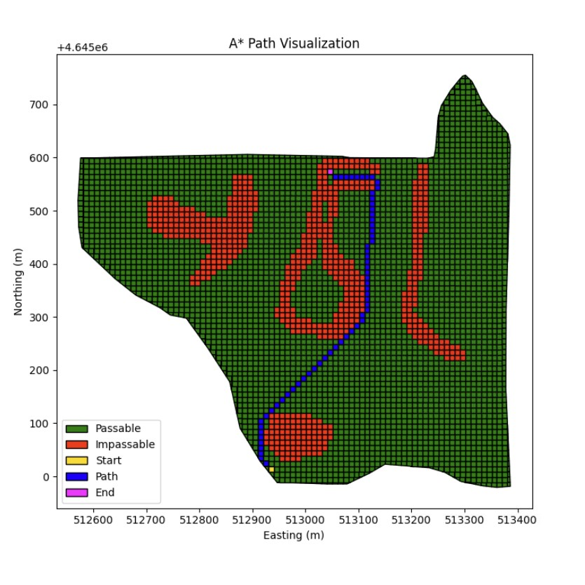
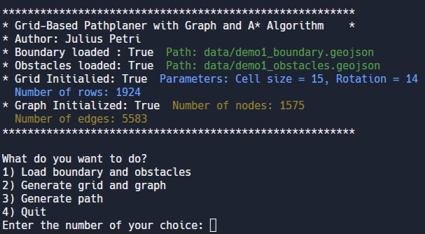

# Grid-Based Path Planner for UAV Flights

This is a Python project that uses geographical data to create a grid-based path planner. The project allows you to generate a grid over geographical data like a polygon boundary and polygon obstacles, create a graph from the grid, and find the shortest path from a start point to an end point using the A* algorithm.



## Features

The Grid-Based Path Planner has the following features:

1. Generate a customizable vector grid over geographical data.
2. Create a graph from the grid where each node represents a cell and each edge represents adjacency between two cells.
3. Find the shortest path from a start point to an end point using the A* algorithm.
4. Visualize the grid and the path.

## Installation

To run this project, you need Python 3.x installed on your computer. You can download the latest version of Python from the official website: https://www.python.org/downloads/

You will also need to install the following packages:

* os
* math
* geopandas
* networkx
* matplotlib
* shapely

You can install these packages using pip:

```bash
pip install geopandas networkx matplotlib shapely
```

## Usage

To use the Grid-Based Path Planner, run the `main.py` file in your favorite Python environment or from the terminal with the command `python main.py`.

The script will display a menu with the available options. You can select an option by entering the corresponding number.

1. To load polygons and obsacles in .geojson from the data folder select 1)
2. To generate a grid from the loaded data, select option 2) and follow the prompts.
3. To find the shortest path from a start point to an end point, select option 3 and follow the prompts.
4. To exit select option 4)



## Contributing

Contributions are welcome! If you would like to contribute to this project, please fork this repository, make your changes, and submit a pull request.

## License
This project is licensed under the MIT License. See the LICENSE file for details.
